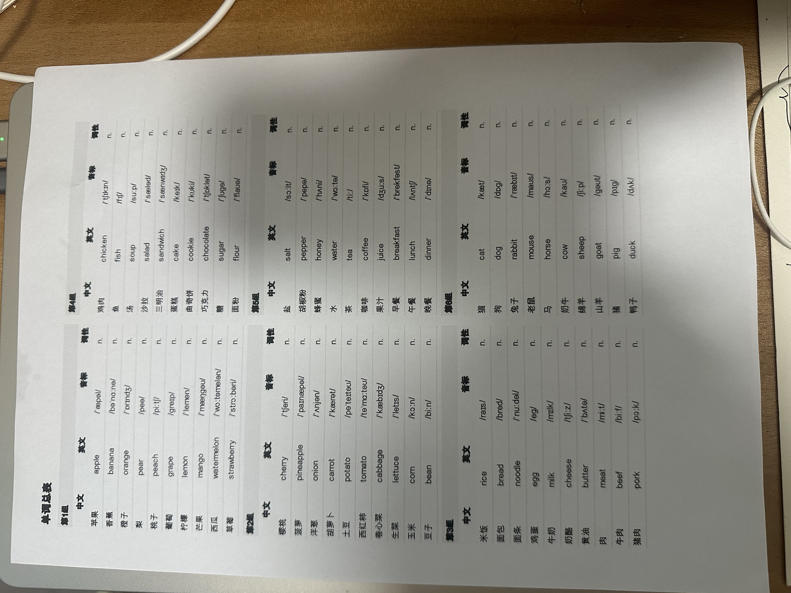
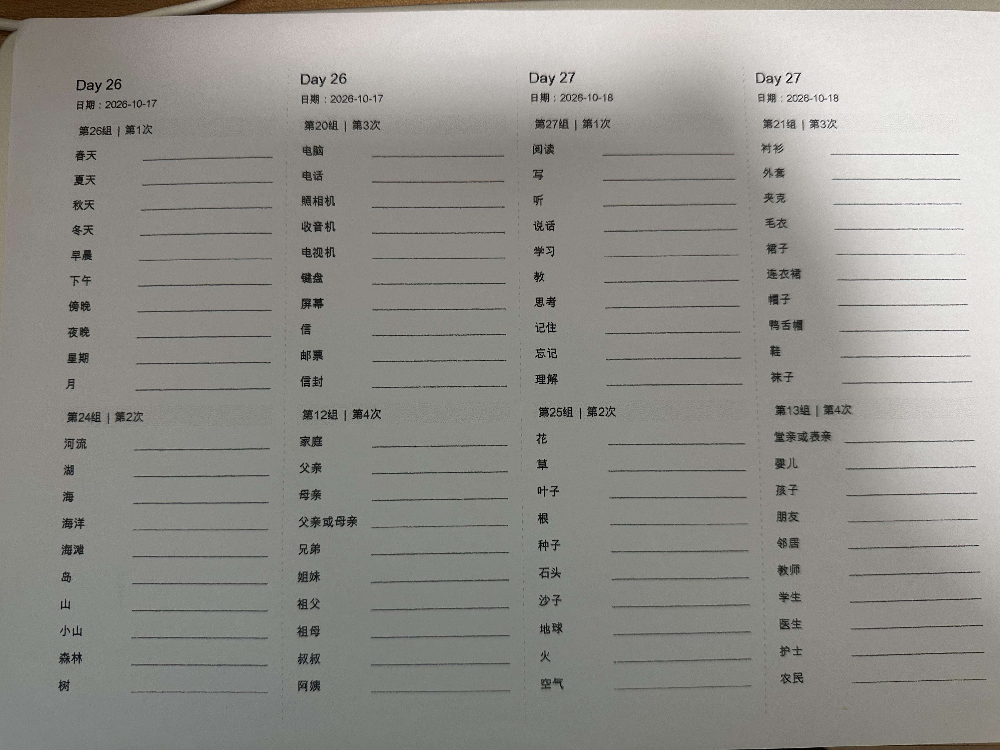

# 艾宾浩斯式单词复习 Skill

**上传单词材料，得到一份家长答案表和一本孩子能直接写的复习册。**

免费开源，面向 Codex、WorkBuddy 等能读取 Skill 并运行 Python 的 AI 助手。本地排期和文件生成不需要 API 密钥、不调用付费接口；使用 AI 平台本身可能产生费用。

## 开始使用

将下面这句话发给 Codex：

> 请从 https://github.com/ccylliu-cloud/ebbinghaus-vocabulary 安装 skills/ebbinghaus-vocabulary 这个 Skill，阅读运行说明并检查 Python 依赖。

安装后上传照片、PDF 页面、Word、Excel 或文本，再说：

> 用艾宾浩斯式单词复习整理这些单词，先告诉我每天新增5词和10词的完整周期、每日峰值，让我选择。日期留空。

已有明确方案时可以直接说“每天新增5词”。识别不清或缺少中英文的内容需要核对，不能猜词。AI 整理后由本地程序生成文件。

**[下载通用 Skill 包](dist/ebbinghaus-vocabulary-v1.0.1.zip) · [下载 WorkBuddy 包](dist/ebbinghaus-vocabulary-workbuddy-v1.0.1.zip) · [浏览样例](examples/README.md)**

WorkBuddy 用户可下载专用包，交给 WorkBuddy：

> 请把附件安装为本地技能，检查运行依赖。之后用它把我上传的词表做成可打印的复习材料。

专用包在 ZIP 根目录提供 `SKILL.md`，按[官方技能结构](https://open.workbuddy.cn/docs/skill)补充中英文简介、版本和作者信息。它与通用版共用生成代码；尚未完成 WorkBuddy 客户端实机验收，也未上架其技能市场。若当前客户端不接受 ZIP，让它解压到自己的技能目录并读取 `SKILL.md`。

## v1.0.1 更新

修复教材长释义在总表中换行后显示不全、不同导出方式列宽不一致的问题。中文、英文、音标、词性标题与正文统一左对齐。练习册的长释义使用整列宽度，默写线放在下方，保留原书的完整用法说明。

新增长文本与办公软件实际打印回归检查；原有分组、复习周期和自适应字段规则保持不变。

## 你会得到什么

| 文件 | 打印与内容 |
| --- | --- |
| **单词总表.xlsx** | A4 纵向，左右双区；按完整组排列，供家长查答案；预设打印区域和分页。 |
| **艾宾浩斯复习打印册.pdf** | A4 横向，固定4列；中文提示＋英文书写空白；每列有 Day 和手填日期；可折叠或裁剪。 |

原资料有音标、词性就保留，没有就不自动补。Excel 按每组实际信息选择版式：

| 原资料包含的字段 | 总表版式 |
| --- | --- |
| 中文、英文 | 中文｜英文｜中文｜英文；10词5行，5词3行 |
| 中文、英文、词性 | 中文｜英文｜词性 |
| 中文、英文、音标 | 中文｜英文｜音标 |
| 中文、英文、音标、词性 | 中文｜英文｜音标｜词性 |

仅显示组号，不给单词编号。整组皆空的可选字段不占列；组内部分缺失的信息留白。组不跨区域或页面，尾组不借其他组的词来填满。

练习册**列不混天、天不跨页**：前期一页可放多天，任务多时一天可占连续多列。没有答案、勾选、掌握度和正确率。

## 实打印照片

由项目作者提供的实打印记录。总表照片展示四字段版式；两字段紧凑版见[可下载样例](examples/README.md)。练习册照片为早期样张，含具体日期；**v1.0.0 输出统一留空日期**。照片保留原始拍摄方向。





## 两种方案怎么选

每组在首次学习的第 **1、3、7、15、30 天**出现，共5次，均为汉译英。

- 完整周期：`ceil(单词数 / 每天新增词数) + 29` 天。
- 每日峰值按实际词量和排期计算，最多通常为25词或50词。
- 没有任务的日子不打印空白列，Day 编号保持原排期。

例如300词：

| 每天新增 | 组数 | 完整周期 | 实际每日峰值 |
| --- | ---: | ---: | ---: |
| 5词 | 60组 | 89天 | 25词 |
| 10词 | 30组 | 59天 | 50词 |

少量词的实际峰值可能更低，所以 Skill 会先统计材料，再让家长选择方案。这里采用固定间隔复习排期，不是针对个人记忆能力的预测模型。

## 不通过 AI，也能运行

需要 Python 3.10+。从仓库根目录执行以下命令，Windows 可用 `py`，macOS/Linux 常用 `python3` 替换 `python`。建议使用虚拟环境。

```sh
python -m pip install -r skills/ebbinghaus-vocabulary/requirements.txt
python skills/ebbinghaus-vocabulary/scripts/vocab.py compare skills/ebbinghaus-vocabulary/examples/词表示例.csv
python skills/ebbinghaus-vocabulary/scripts/vocab.py build skills/ebbinghaus-vocabulary/examples/词表示例.csv --daily 5 --out result
```

这里输入的是**已整理并核对的词表**。照片识别可以交给宿主 AI；本地 OCR 是可选功能，需要另外安装 Tesseract 的 `eng`、`chi_sim` 语言包，扫描 PDF 另需 Poppler。HEIC/HEIF 另需 `pillow-heif`，或先导出 JPG。旧 `.doc` / `.xls` 需另存为 `.docx` / `.xlsx`。详见[运行说明](skills/ebbinghaus-vocabulary/references/usage.md)。

PDF 会优先嵌入本机可用的中文 TrueType 字体；没有时回退到阅读器的标准中文字体。可用 `VOCAB_FONT` 指定可嵌入的中文 TTF/TTC。Excel 显示和打印使用本机字体，首次使用请看打印预览；改长释义或增删词后重新生成，以便重新分页。

## 开发与验证

```sh
python skills/ebbinghaus-vocabulary/scripts/test_vocab.py
python tools/package_release.py
```

自动测试覆盖复习次数、实际峰值、5/10词分组、2/3/4字段、整组分页、多天共页、单天多列、空日期、答案不泄露到练习册，以及独立 Python 导出。GitHub Actions 配置在 Linux、Windows、macOS 上执行测试；测试状态以仓库 Actions 实际结果为准。

v1.0.1 已通过15项常规测试，并在开发机器上用 LibreOffice 检查两种导出引擎、5/10词方案及混合字段多页打印；实际 Excel/WPS 客户端及实体打印尚未复测。通用 Skill 的会话规则和各宿主的安装入口仍可能受宿主版本影响；遇到问题可提交 [Issue](https://github.com/ccylliu-cloud/ebbinghaus-vocabulary/issues)，附匿名小词表、操作系统和错误提示即可。

代码与文档采用 [MIT License](LICENSE)。实打印照片仅供本项目效果展示，版权归照片提供者；不随 MIT 软件许可授予独立商用授权。仓库不包含用户私有词表、密钥或系统字体文件。AI 读取上传材料时遵循所使用平台的数据处理规则。
